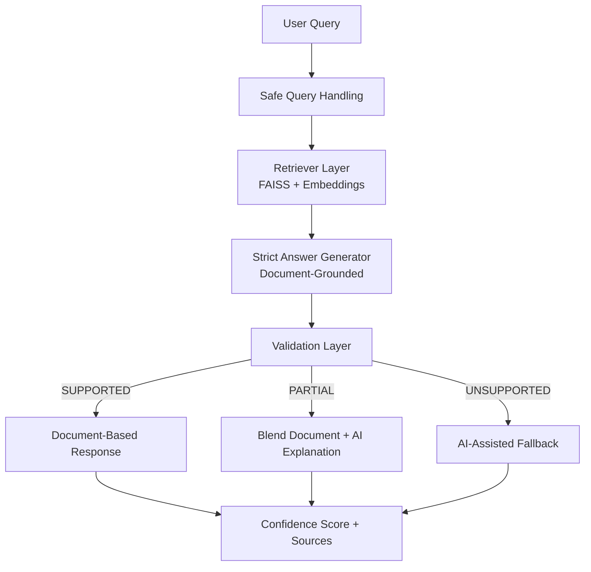

# Agentic AI Compliance Assistant v2


---

## Overview

An enterprise-focused **Agentic AI Compliance Solution** designed to deliver **trusted, explainable, and governed regulatory intelligence**.

This solution goes beyond traditional RAG by introducing a **validation and decision layer** that determines whether a response is fully supported by documents, partially supported, or unsupported before deciding how to respond.

---

## Key Concept

Traditional RAG:  
Retrieve → Generate → Return  

This Solution:  
Retrieve → Generate → Validate → Decide → Respond  

---

## Key Features

- **Retrieval-Augmented Generation (RAG)** over regulatory/compliance PDFs
- **Strict document-grounded answering**
- **Validation layer** to classify responses as:
  - `SUPPORTED`
  - `PARTIAL`
  - `UNSUPPORTED`
- **Confidence scoring** based on retrieval quality
- **Controlled AI fallback** for unsupported or partially supported queries
- **Explainable outputs** with source references and optional retrieved context

---

## Why this is Agentic AI

This is called an **Agentic AI solution** because the system does not simply retrieve and answer.

It performs a sequence of autonomous steps:

1. **Retrieves** relevant document evidence
2. **Generates** a strict document-grounded answer
3. **Validates** whether the answer is actually supported
4. **Decides** whether to:
   - return a document-based answer
   - blend with AI explanation
   - fall back to AI-assisted insight
5. **Responds** with confidence and traceability

This introduces **decision-making, control, and governed behavior**, which are essential in compliance environments.

---

## Architecture Overview

```text
User Query
   ↓
Safe Query Handling
   ↓
Document Retrieval (FAISS + Embeddings)
   ↓
Strict Answer Generation
   ↓
Validation Layer
   ├── SUPPORTED   → Document-Based Response
   ├── PARTIAL     → Blend Document + AI Explanation
   └── UNSUPPORTED → AI-Assisted Fallback
   ↓
Confidence Score + Source Traceability

---

## **Architecture Diagra**



---

Solution Flow

Retrieve → Generate → Validate → Decide → Respond

This is the core design principle of the solution.

---

Business Value
Problem

Regulatory and compliance teams often work with fragmented document repositories and require reliable, traceable answers.

Solution

An Agentic AI assistant that combines RAG, validation, and controlled fallback logic.

Impact

Enables:

---

## Tech Stack

Tech Stack
Python
Streamlit
LangChain
OpenAI
FAISS
PyPDF
TextBlob

---

## How to Run

1. Install dependencies:
   pip install -r requirements.txt

2. Set API key:
   export OPENAI_API_KEY="your_api_key"

3. Add PDF files to:
   /content/data

4. Run application:
   streamlit run app.py

---

## Demo Examples

Example 1:
Query: What is Customer Due Diligence?
Result: Document-based answer (SUPPORTED)

Example 2:
Query: What is Model Context Protocol?
Result: AI-assisted fallback (UNSUPPORTED)

Scenario2-AI-Assisted Insight


---

## Author

Leela Krishna.T
Director | Data & AI/ML | Agentic AI | Compliance Systems
