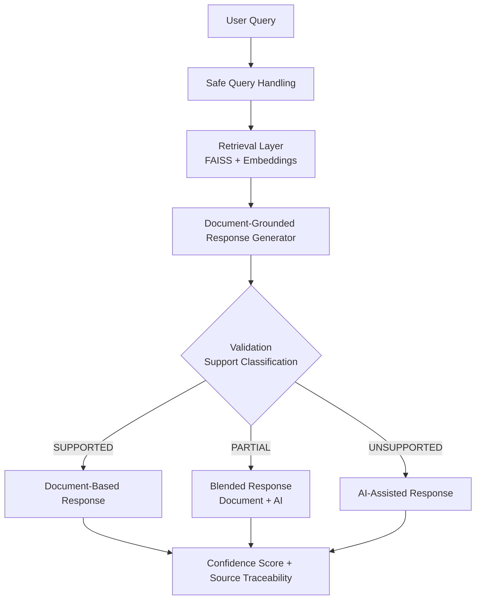

# Agentic AI Compliance Assistant v2

---

## Overview

An enterprise-grade **Agentic AI Compliance Solution** designed to deliver **trusted, explainable, and governed regulatory intelligence for compliance and risk environments**.

This solution enhances traditional RAG by introducing a validation and decision layer, ensuring responses are reliable, traceable, and aligned with compliance requirements.

Designed for compliance use cases where accuracy, traceability, and controlled AI behavior are critical.

---

## Key Concept

**Traditional RAG:**  
Retrieve → Generate → Return

**Agentic AI Flow:**  
Retrieve → Generate → Validate → Decide → Govern → Respond

---

## Key Features

- Retrieval-Augmented Generation (RAG) over regulatory and compliance documents  
- Strict document-grounded responses  
- Validation layer for response support classification:
  - `SUPPORTED`
  - `PARTIAL`
  - `UNSUPPORTED`
- Confidence scoring  
- Controlled AI-assisted fallback for unsupported queries  
- Explainable responses with source traceability  

---

## Architecture

High-level flow of the Agentic AI decision pipeline:

User Query
   ↓
Safe Query Handling
   ↓
Document Retrieval (FAISS Vector Search + Embeddings)
   ↓
Strict Answer Generation
   ↓
Validation Layer (Response Support Classification)
   ├── SUPPORTED   → Document-Based Response
   ├── PARTIAL     → Blend Document + AI Explanation
   └── UNSUPPORTED → AI-Assisted Fallback
   ↓
Confidence Scoring + Source Traceability

Designed for compliance use cases where accuracy, traceability, and controlled AI behavior are essential.

---

## Architecture Diagram

---

## Why this is Agentic AI

This solution is called **Agentic AI** because it does not simply retrieve and answer.

Instead, it follows a sequence of controlled steps:

- Retrieves relevant document evidence
- Generates a strict document-grounded answer
- Validates whether the answer is supported
- Decides the appropriate response strategy
- Returns the response with confidence and traceability

This introduces **decision-making, control, and governance**, which are critical in compliance environments.

---

## Business Value

**Problem**  
Fragmented regulatory documents and low trust in AI outputs  

**Solution**  
Agentic AI system with validation and controlled decision logic  

**Impact**
- Trusted decision-making  
- Explainable and auditable AI outputs  
- Audit-ready traceability  
- Reduced hallucination risk  

---

## Tech Stack

- Python (Core programming)
- Streamlit (UI / Application layer)
- LangChain (LLM orchestration)
- OpenAI (LLM / Generation)
- FAISS (Vector search / Retrieval)
- PyPDF (Document ingestion)
- TextBlob (Text processing / validation support)

---

## How to Run

1. Install dependencies

       pip install -r requirements.txt

2. Set API key

       export OPENAI_API_KEY="your_api_key"

3. Add PDFs to

       /content/data

4. Run app

       streamlit run app.py

---

## Demo Examples

These examples demonstrate how the system differentiates between supported and unsupported queries and applies controlled response strategies.

**Example 1 — Document-Based Response (SUPPORTED)**  
Query: What is Customer Due Diligence?  
→ Response generated strictly from document evidence  

**Example 2 — AI-Assisted Insight (UNSUPPORTED)**  
Query: What is Model Context Protocol?  
→ Response generated using controlled AI-assisted fallback  

---

## Demo Screenshots

Below screenshots illustrate system behavior across different validation outcomes:

### Scenario 1 — Document-Based Response (SUPPORTED)

### Scenario 2 — AI-Assisted Insight (UNSUPPORTED)

---

## Author

**Leela Krishna.T**  
Director | Data & AI/ML | Agentic AI | Compliance Systems  

Focused on building reliable, explainable, and enterprise-grade AI solutions.
