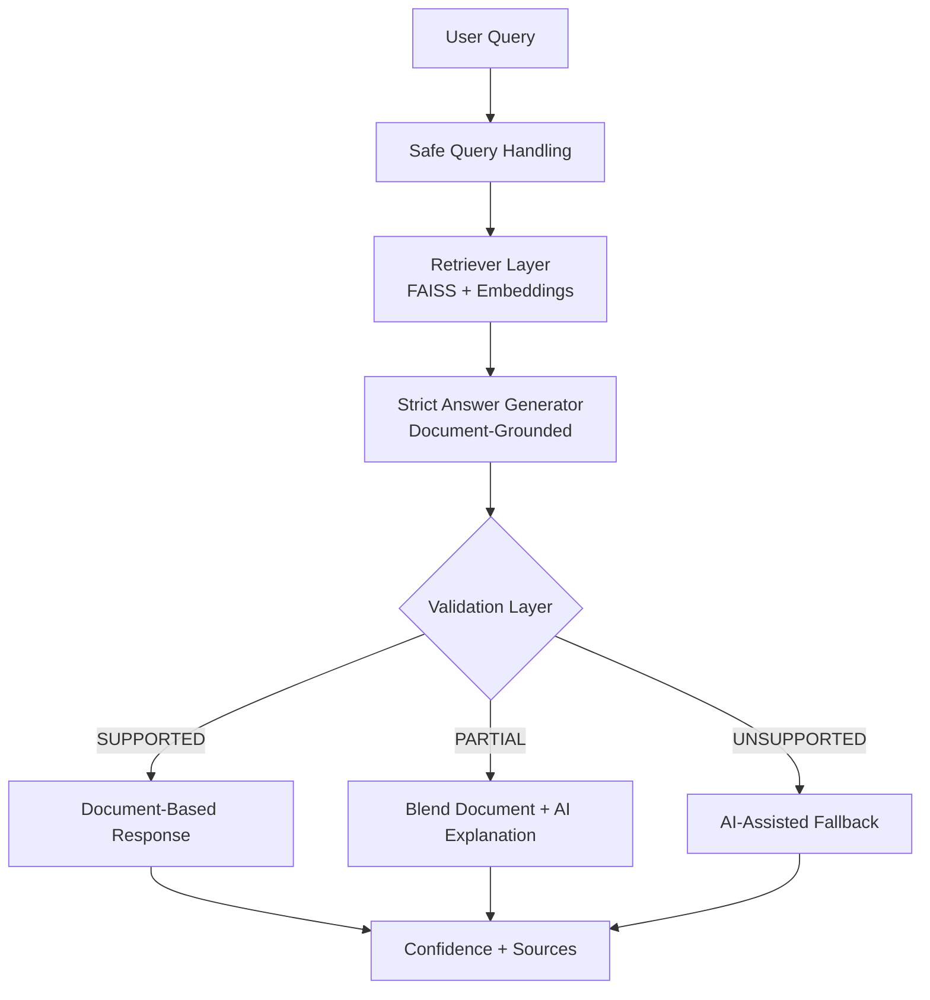

# Agentic AI Compliance Assistant v2

---

## Overview

An enterprise-focused **Agentic AI Compliance Solution** designed to deliver **trusted, explainable, and governed regulatory intelligence**.

This solution enhances traditional RAG by introducing a **validation and decision layer**, ensuring responses are reliable, traceable, and aligned with compliance requirements.

---

## Key Concept

**Traditional RAG:**  
Retrieve → Generate → Return  

**This Solution:**  
Retrieve → Generate → Validate → Decide → Respond  

---

## Key Features

- Retrieval-Augmented Generation (RAG) over regulatory PDFs  
- Strict document-grounded answering  
- Validation layer:
  - `SUPPORTED`
  - `PARTIAL`
  - `UNSUPPORTED`
- Confidence scoring  
- Controlled AI fallback  
- Explainable outputs with source traceability  

---

## Why this is Agentic AI

This solution is called **Agentic AI** because it does not simply retrieve and answer.

It performs a sequence of controlled steps:

1. Retrieves document evidence  
2. Generates a strict answer  
3. Validates answer support  
4. Decides response strategy  
5. Responds with confidence and traceability  

This introduces **decision-making, control, and governance**, which are critical in compliance environments.

---

## Architecture Overview

    User Query
       ↓
    Safe Query Handling
       ↓
    Document Retrieval (FAISS + Embeddings)
       ↓
    Strict Answer Generation
       ↓
    Validation Layer
       ├── SUPPORTED   → Document-Based Response
       ├── PARTIAL     → Blend Document + AI Explanation
       └── UNSUPPORTED → AI-Assisted Fallback
       ↓
    Confidence + Sources

  Designed for compliance use cases where accuracy, traceability, and controlled AI behavior are critical.

---

## Architecture Diagram

---

## Solution Flow

Retrieve → Generate → Validate → Decide → Respond  

---

## Business Value

**Problem**  
Fragmented regulatory documents and low trust in AI outputs  

**Solution**  
Agentic AI system with validation and controlled decision logic  

**Impact**
- Trusted decision-making  
- Explainable AI  
- Audit-ready traceability  
- Reduced hallucination risk  

---

## Tech Stack

- Python  
- Streamlit  
- LangChain  
- OpenAI  
- FAISS  
- PyPDF  
- TextBlob  

---

## How to Run

1. Install dependencies  

       pip install -r requirements.txt  

2. Set API key  

       export OPENAI_API_KEY="your_api_key"  

3. Add PDFs to  

       /content/data  

4. Run app  

       streamlit run app.py  

---

## Demo Examples

**Example 1**  
Query: What is Customer Due Diligence?  
→ Document-based answer (SUPPORTED)

**Example 2**  
Query: What is Model Context Protocol?  
→ AI-assisted fallback (UNSUPPORTED)

---

## Demo Screenshots

### Document-Based Response

### AI-Assisted Insight

---

## Author

**Leela Krishna.T**  
Director | Data & AI/ML | Agentic AI | Compliance Systems
